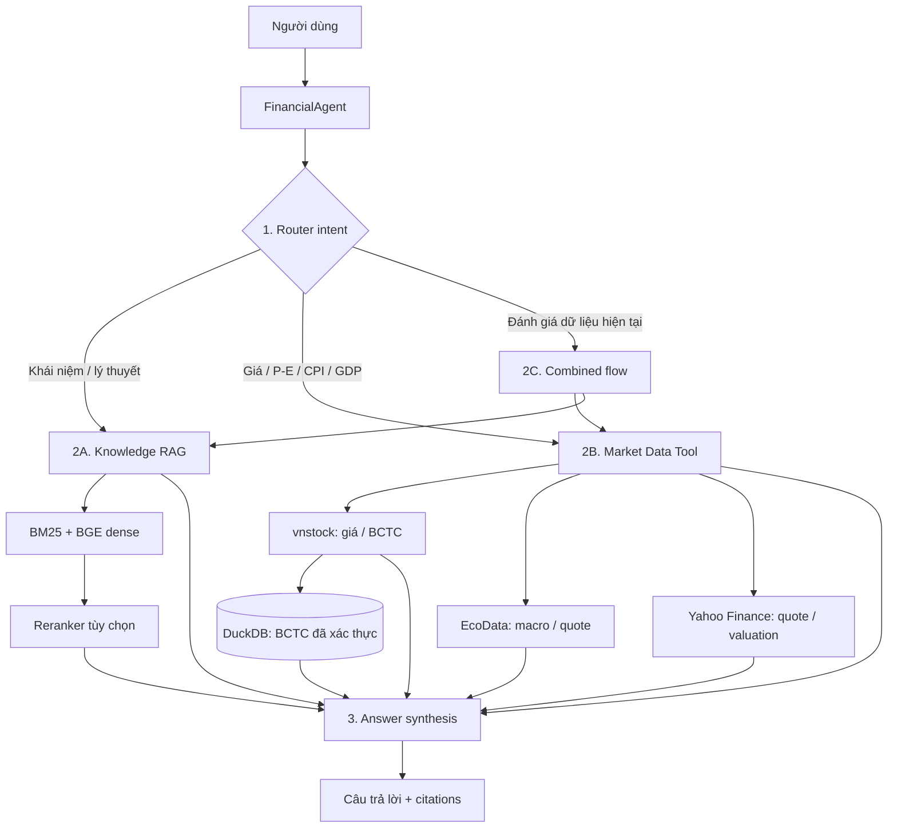

# AI Financial Assistant

Trợ lý tài chính tiếng Việt với ba đường xử lý tách biệt: dữ liệu thị trường thời gian thực, tri thức nền tảng RAG, và phân tích kết hợp. Dữ liệu thay đổi theo thị trường không được đưa vào Vector Database.

## Kiến trúc



### Quy tắc định tuyến

| Câu hỏi | Đường xử lý |
| --- | --- |
| `GDP là gì?`, `CAPM hoạt động ra sao?` | Knowledge RAG |
| `P/E của FPT hiện tại là bao nhiêu?`, `CPI Việt Nam hiện tại?` | Market Data Tool |
| `P/E FPT hiện tại cao hay thấp?` | Market Data Tool + RAG context |
| `Doanh thu VNM 2024?` | Financial-statement analysis |

## Cấu trúc mã nguồn

```text
agent.py                 Router và 5 bước orchestration
market_data/             Adapters vnstock, EcoData, Yahoo, DuckDB
knowledge/               Collections, seed documents, Qdrant store
retrieval/               BM25, BGE dense retrieval, reranker, hybrid fusion
tools/                   Market data, concept, statement, economic, portfolio tools
etl/                     Extract → transform → chunk → metadata → Qdrant load
app.py                   FastAPI API và khởi tạo các layer
main.py                  CLI dùng chung aggregator + FinancialAgent
tests/                   Unit tests cho routing và citation
```

## Luồng thực thi

1. `FinancialAgent.answer()` phân loại intent trước khi truy cập dữ liệu.
2. Trích xuất ticker, năm và metric bằng parser deterministic; LLM là tùy chọn.
3. Chọn một tool theo intent để giữ ranh giới giữa dữ liệu live và RAG.
4. Tool trả về dữ liệu, phép tính, context và citation có cấu trúc.
5. LLM chỉ được phép diễn đạt lại kết quả phân tích BCTC đã có số liệu; không
   được suy đoán dữ liệu mới.

## Chạy dự án

```bash
pip install -r requirements.txt
uvicorn app:app --reload
# hoặc
python main.py --question "P/E của FPT hiện tại là bao nhiêu?"
```

Biến môi trường chính:

- `GROQ_API_KEY`, `GROQ_MODEL` — LLM Groq; `QROQ_*` cũ vẫn tương thích.
- `ECODATA_API_KEY`, `ECODATA_MACRO_PATH`, `ECODATA_QUOTE_PATH` — dữ liệu
  macro/quote EcoData, tùy theo endpoint của gói dịch vụ.
- `BGE_MODEL` — mặc định `BAAI/bge-small-en-v1.5`.

## ETL tri thức

```bash
python -m etl.run_etl --list
python -m etl.run_etl --source investopedia_financial --limit 20
```

ETL chỉ lấy URL được cấu hình hoặc phát hiện từ sitemap; sau đó làm sạch bằng Trafilatura/BeautifulSoup, chunk 800 ký tự với overlap 150 và ghi metadata
`topic`, `category`, `difficulty`, `source`, `updated_at` vào Qdrant.
